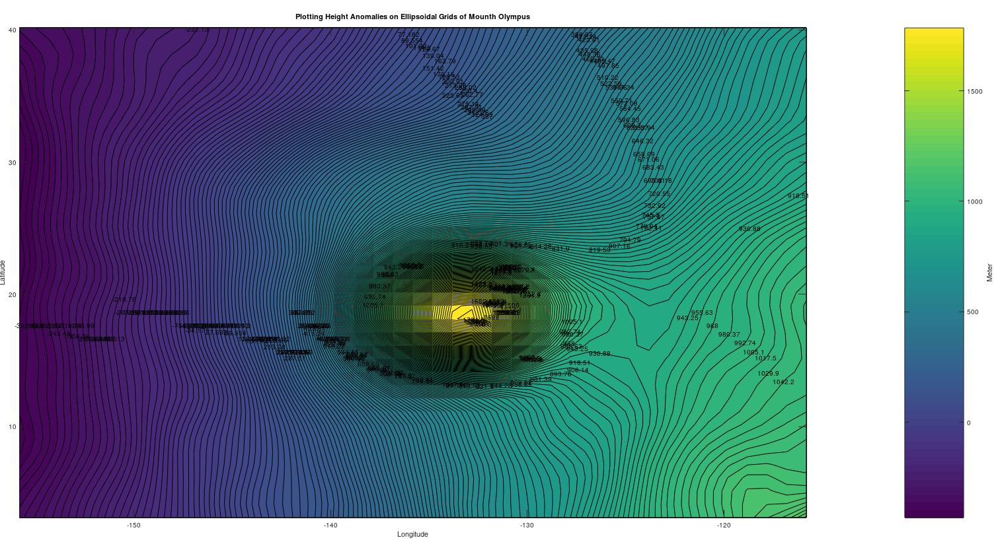
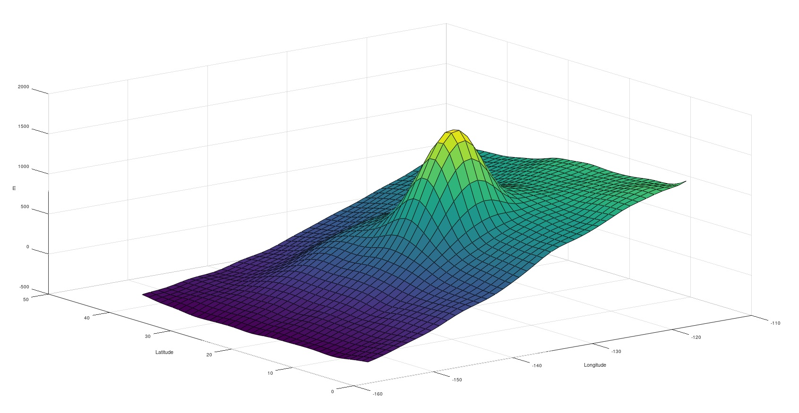
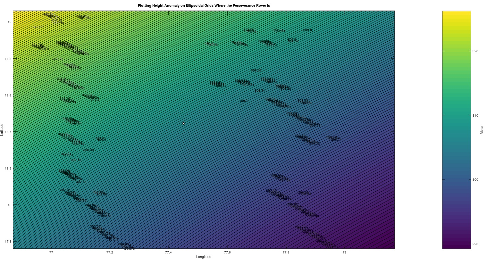
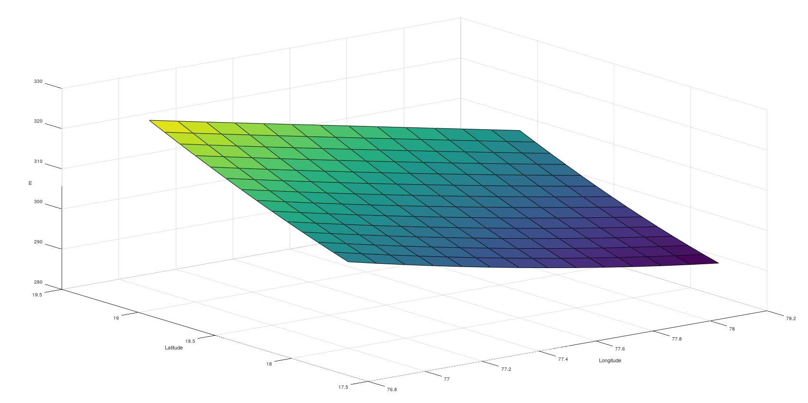
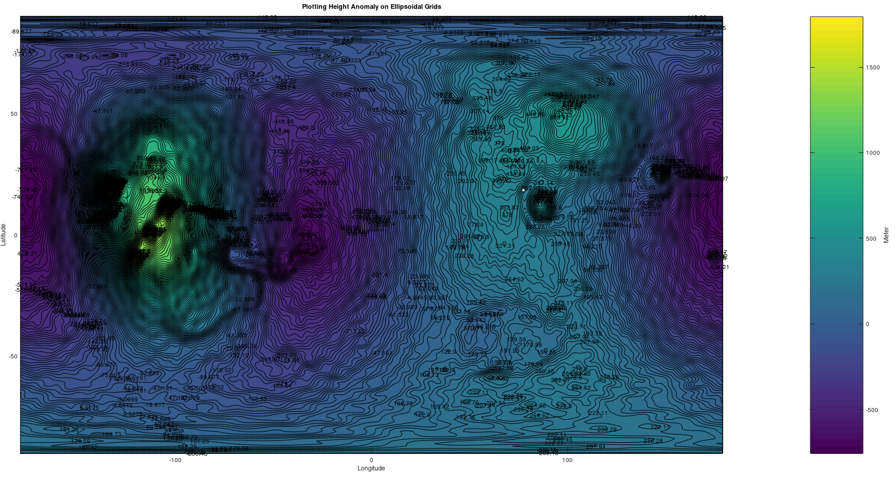
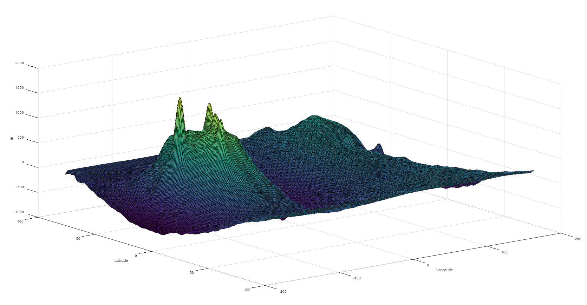

# Plotting Height Anomalies on planet Mars and around Perseverance rover, Mount Olympus

## Project Statement

The aim of the project is plotting the height anomaly values with contour lines on planet Mars also specially around Perseverance rover, Mount Olympus with MATLAB.

### [Short Information of Perseverence](https://mars.nasa.gov/mars2020/):
-   Mission Name: Mars 2020
-   Rover Name: [Perseverance](https://mars.nasa.gov/news/8622/virginia-middle-school-student-earns-honor-of-naming-nasas-next-mars-rover/)
-   Main Job: Seek signs of ancient life and collect samples of rock and regolith (broken rock and soil) for possible return to Earth.
-   Launch: July 30, 2020
-   Landing: Feb. 18, 2021, Jezero Crater, Mars

The rover's coordinates may vary from time to time. If you want to change the coordinate values, you can replace the values ​​in the ***mars_height_anomaly_ell_Perseverance.m*** file with the values ​​on the [mars.nasa.gov](https://mars.nasa.gov/mars2020/mission/where-is-the-rover/) website.

## Dataset

The datasets available for the study were created through the .gdf files on the [ICGEM](http://icgem.gfz-potsdam.de/calcgrid?modeltype=celestial) website and partially based on the parameters shown below.

### mars_OlympusMountain.gdf dataset info:

       long_lat_unit       degree
      latlimit_north       40.140000000000    
      latlimit_south       3.1400000000000    
      longlimit_west       204.19000000000    
      longlimit_east       244.19000000000    
            gridstep       1.0000000000000    
      height_over_ell      0.0000 m
           functional      height_anomaly_ell
            modelname      ggm1025a
             maxvalue      3.2624243E+02 meter
             minvalue      2.8925281E+02 meter

If you want to plot 3D of contour map, please type these on command window:

    surf(X, Y, Z);
    xlabel('Longitude');
    ylabel('Latitude');
    zlabel('m');

### mars_Perseverance.gdf dataset info:

       long_lat_unit     degree
      latlimit_north     19.060000000000    
      latlimit_south     17.760000000000    
      longlimit_west     76.870000000000    
      longlimit_east     78.170000000000    
            gridstep     0.10000000000000    
     height_over_ell     0.0000 m
          functional     height_anomaly_ell
           modelname     ggm1025a
            maxvalue     3.2624243E+02 meter
            minvalue     2.8925281E+02 meter

If you want to plot 3D of contour map, please type these on command window:

    surf(X, Y, Z);
    xlabel('Longitude');
    ylabel('Latitude');
    zlabel('m');

  

### mars_height_anomaly_ell.gdf dataset info:

       long_lat_unit     degree
      latlimit_north     90.000000000000    
      latlimit_south     -90.000000000000    
      longlimit_west     -179.00000000000    
      longlimit_east     179.00000000000    
            gridstep     1.0000000000000    
     height_over_ell     0.0000 m
          functional     height_anomaly_ell
           modelname     ggm1025a
            maxvalue     1.7952732E+03 meter
            minvalue     -7.5576053E+02 meter

If you want to plot 3D of contour map, please type these on command window:

    surf(X, Y, Z);
    xlabel('Longitude');
    ylabel('Latitude');
    zlabel('m');

**Please review the .pdf files for more detailed information.**

##  What is Height Anomaly?

Please take a look at these links if you want to know what is height anomaly.

 1. https://apps.ecmwf.int/codes/grib/param-db/?id=171156 
    
 2. https://en.wikipedia.org/wiki/Normal_height

## Contact Me

If you have something to say to me please contact me: 

 - Twitter: [Doguilmak](https://twitter.com/Doguilmak)
 - Mail address: doguilmak@gmail.com
 
